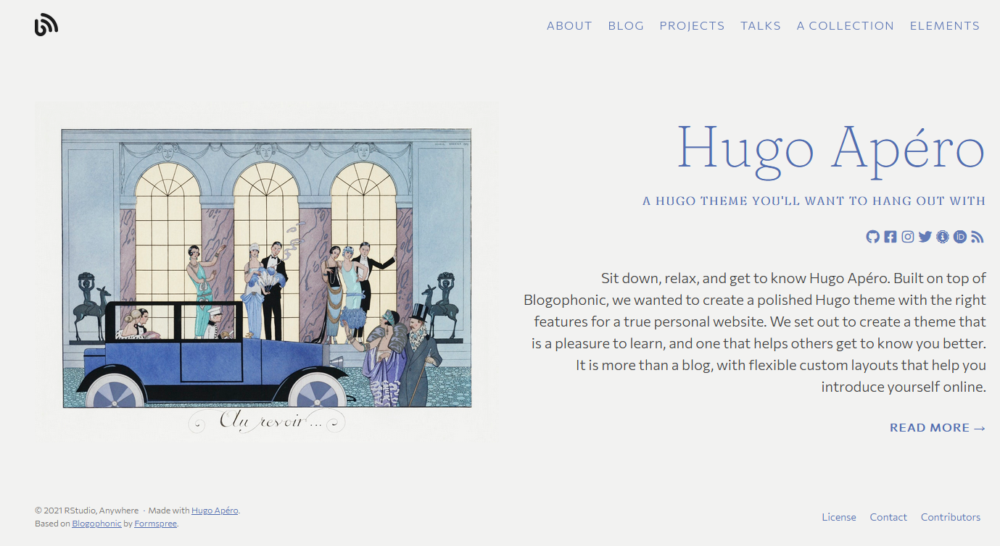
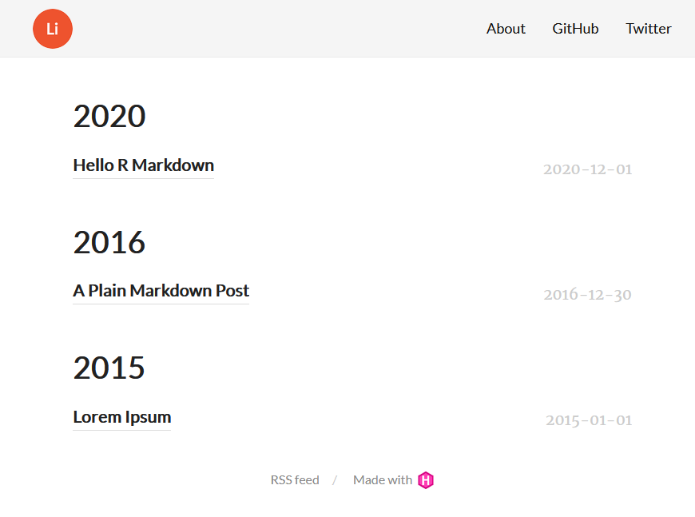

Hi! This is my first blog post on my first website created with the R `{blogdown}` package and I am going to explain the few tweaks I made to the default Lithium Hugo theme. Go through the summary below to have the short version or follow along for the full details.

<!-- Note box -->

A few naming conventions to make the text formatted as code easier to read:  
- `{packagenames}` are surrounded by "`{}`", ex. `{blogdown}`.
- `variable_names` have no punctuation except "`_`" as word separator, ex. the `menu` entry in the configuration file.
- `file.names` are presented with their extension, ex. `config.yaml`.
- `/directory names/` are surrounded by "`/`" and preceded by their path to the website root directory, ex. `/content/post/`.

<!-- Summary -->

## In a Nutshell

I developed the initial version of my personal website with a these goals regarding content and structure:

- [Home]: empty page (no blog posts) stating the website is still under construction,
- [About]: short bio,
- [Blog]: repo for posts, basic formatting,
- [Links]: A few links to github and external websites based on icons.

It took me a couple of days to have it up and running and my main findings were:

1. With the `{blogdown}` [book](https://bookdown.org/yihui/blogdown/), Alison Hill's [post](https://www.apreshill.com/blog/2020-12-new-year-new-blogdown/) and [github](https://github.com/apreshill) repository, I could make it work!
1. Early 2022 is not the best time to start using blogdown as the documentation is catching up with the tools' evolution. I would recommend to start with a simple theme and stay tuned for awesome themes being developed by the `{blogdown}` book authors and the R community (see [Hugo Apéro](https://hugo-apero.netlify.app/)). The Lithium theme looks simple but easy to customize.
1. my tweaks:  
    + change the logo and favicon,
    + modify the navigation bar,
    + reorganize the blog posts in a [Blog] page,
    + add CSS class to add boxes to my posts,
    + add Font Awesome icons to the Navbar and markdown files,
    + add an animated background via CSS,

<!-- Before we start -->

## Before we start

I wanted to have my own website for a lonnnng time and I finally had a little free time this January (2022) before going back to work. I am fairly good with [`{rmarkdown}`]() and [`{bookdown}`]() and this was the time to give [`{blogdown}`]() a try!

I am an advanced R user but only know basic html and css and no javascript for now. Really hoped `{blogdown}` could do the heavy lifting and I could focus on the R and Rmarkdown content. But I couldn't stop myself from trying to tweak the default templates and break everything... And I did! So why not use my first post to give a small list of my main findings.

### Big thanks to the R community 

Before diving in the code, I wanted to give a massive shout-out to the R community. I am particularly grateful for all the awesome tools making code and output more fun, easier to grasp and (most importantly) beautiful.

It's hard to compete with Office suites and motivate people to learn coding when:

- they are already familiar with spreadsheets and docs (and all the bad habits that come with them), and 
- basic knowledge of programming language doesn't give much more than very basic and blend illustrations and reports.

Thanks to the Rstudio crew and the larger R community, teaching R and motivating people to learn R with visually pleasing content as become easier, including my own motivation to keep investing my time to learn new ways to use R for making data analysis and products attractive. 

<!-- Key concept -->

<hgr> 

## A few key concepts

### Read these 

In my research for creating a website with `{blogdown}`, I found the best entry points were Yihui's [`{blogdown}` book](https://bookdown.org/yihui/blogdown/) and Alison Hill's blog (this [post](https://www.apreshill.com/blog/2020-12-new-year-new-blogdown/) in particular). They were both slightly outdated, but 90% of what you need to know is there and Alison post had the best tutorial for creating your website and deploy it with R, Rstudio, Github and Netlify. 

However, note that the post was based on the Hugo theme [`wowchemy/starter-academic`](https://github.com/wowchemy/starter-hugo-academic) and this theme was not fully compatible with `{blogdown}` as of early 2022. The organization behind the theme recommended its own method for installing the theme. See this issue [638](https://github.com/rstudio/blogdown/issues/638) on `{blogdown}` Github repo and Yihui's comment:

> This issue seems to be fixable to me, but I can't guarantee that it won't happen again in the future. At some point, I might have to just give up and let users follow the official instructions to install extra system dependencies like Go and GIT...  
> --- Yihui's comment on Github rstudio/blogdown issue 638 

### Themes 

In a few messages and repositories on Github, it seemed that the recommended Hugo theme has become [Hugo Apéro](https://github.com/hugo-apero). This theme looked amazing, I loved the name and the style, and its documentation was already very complete. If you are looking for a website that works well, looks nice right off the bat and you are not interesting in a tweaking the theme a lot, this is the theme for you.

 
  

If, like me, you prefer to start with a simpler theme to understand better how themes work and how to customize them, the first two themes developed by Yihui might be better suited: [hugo-xmin](https://github.com/yihui/hugo-xmin) and [hugo-lithium](https://github.com/yihui/hugo-lithium). Both themes are maintained by the `{blogdown}` main developer so there should be around for a while. Xmin layout files are well explained in the book's [template section](https://bookdown.org/yihui/blogdown/templates.html). With the logo and tab icon already included, I chose the lithium theme to tweak to my desired website.

 
  

### Don't touch the `/themes/` subfolders

While reading the `{blogdown}` you can see that the default content and setup are in the `/themes/hugo-yourthemename` and you might be tempted to start editing directly there. Don't! Instead place your inputs in `/content/`, `/layout/` and `/static/` in the root directory of your website. The details below show the path for the Lithium theme but replace `hugo-lithium` with your theme name and this is applicable to your theme: 

- You should place your content in `/content/` and NOT in `/themes/hugo-lithium/exampleSite/content/`. Actually when you create a new post with `blogdown::new_post()` this is done automatically. But if you want to edit or create a navbar entry manually, copy it to or create it in `/content/`. 

- Lithium default CSS is in `/themes/hugo-lithium/static/css`, but add your own CSS in a file (for example `custom.css`) in this directory: `static/css/custom.css`. Some themes allow you to read your CSS with a entry in `config.yaml`, for other themes (including Lithium) you will need to add the path directly in the layout HTML files. (See CSS tweaks below).

- Place your posts' images in your post sub-folders. Specific to Lithium, place your logo in `/static/images/`. The layout will find your logo automatically there, with just the logo file name in `config.yaml`. Note that for main pages like [About], if you want to add images, you need to create the sub-directory `content/about/`, then rename `about.md` to `index.md` and move it in the sub-directory with your images.

the CSS in  layouts are in the  book

`config.yaml`, `/content/`, `/layout/` and `/static/`

Before continuing, please read the post and go through the book. 99% of what you need is there.  

<pre style="padding:0.5em">
themes/hugo-lithium
+-- <b>exampleSite</b>
|   +-- config.toml
|   +-- content
|   |   +-- about.md
|   |   \-- post
|   |       \-- ...
|   \-- ...
+-- <b>layouts</b>
|   +-- partials
|   |   \-- ...
|   \-- _default
|       \-- ...
+-- <b>static</b>
|   \-- ...
\-- ...
</pre>